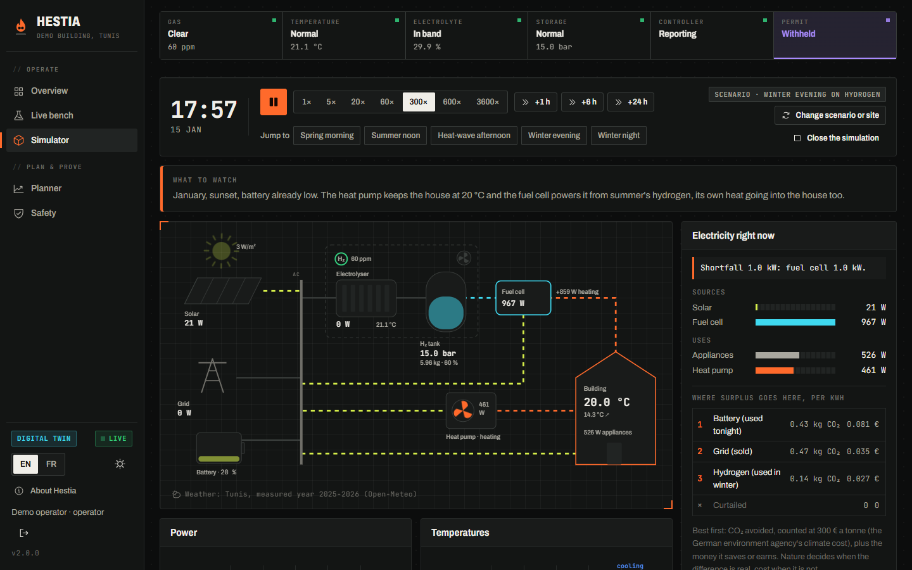
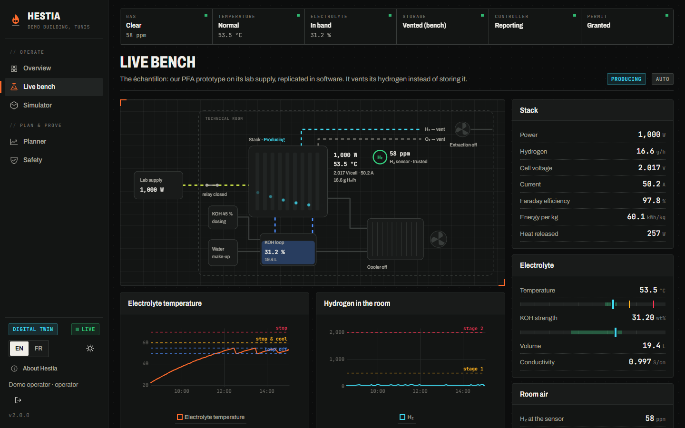
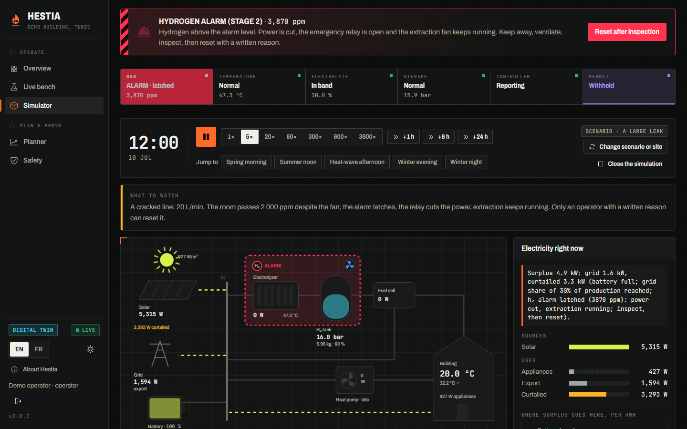
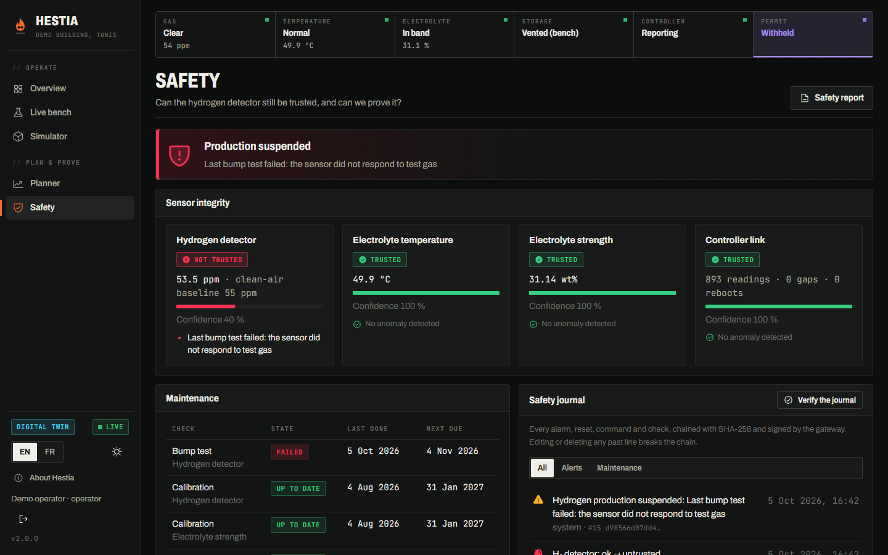
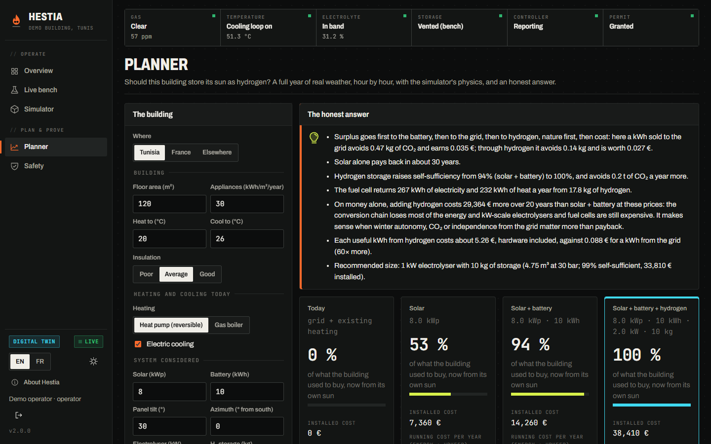

# Hestia

**Solar hydrogen for buildings: supervised, provable, honestly sized.**



A building can turn its summer sun into hydrogen and use it in winter, for
electricity and heat. Two things stop the people who own one: they cannot
tell whether the safety equipment still works, and nobody tells them
honestly whether it pays.

Hestia is the software for both. A controller runs the electrolyser safely
on site; a gateway supervises it, **proves** its safety record, and, before
anyone buys anything, **sizes** the installation on a real year of weather.

## What it does

**Runs a real stack safely.** An alkaline electrolyser in 30 % KOH: the
controller keeps the electrolyte's strength in its band (measured by
density), holds its temperature with a cooling loop while it produces, and
stops to cool only if the loop cannot keep up. Hydrogen in the room is
detected in two stages: at 500 ppm production stops and an extraction fan
runs until the air has been clean for five minutes; at 2 000 ppm the power
is cut and the alarm stays latched until someone writes down what they
found. A pressurised tank stops production at 95 % of its working pressure.

**Shows the bench live.** The *échantillon*, our prototype stack on its lab
supply, as a process diagram with a faceplate for each piece of equipment
and every reading drawn against its limits.



**Lets anyone run a whole building.** Each signed-in visitor gets a private
simulator: a building around a scaled-up stack, with solar panels, a battery,
a 30 bar tank, a fuel cell or a hydrogen boiler, and a heat pump that heats
and cools. Thirteen scenarios start it on a summer day, a winter evening, a
heat wave, a grid outage, a leak, a dead fan or an ageing sensor; or build
your own site, speed up time, break things and watch the system react.



**Proves the detector still works: the trust layer.** A hydrogen sensor can
drift, freeze, die, or get poisoned and keep reading perfectly normal air.
Hestia watches each sensor for those failures, schedules bump tests and
calibrations, computes pass or fail from the measured numbers (nobody can
just tick "passed"), and **stops production while the detector cannot be
trusted**. Every alarm, reset, command and check goes into a hash-chained,
signed journal; the printable safety report carries its fingerprint.



**Sizes it honestly: the planner.** Hour by hour over a full year of real
weather, with the simulator's physics, it compares *today*, *solar*,
*solar + battery* and *solar + battery + hydrogen* for a given building,
sweeps electrolyser and tank sizes, and says plainly when hydrogen does not
pay, and what it buys instead. It ranks where surplus sun should go (battery,
grid or hydrogen) by the CO₂ each kWh avoids, at a carbon price, and the
money it saves: nature first, then cost. It also says how big the tank really is:
20 kg of hydrogen at 30 bar is almost 10 m³.



**Numbers from physics, not brochures.** Tilted panels from measured
weather (PVWatts losses, HDKR transposition), an alkaline stack model with
its cell voltage and Faraday efficiency, real-gas tank pressure, a heat pump
whose COP follows the outdoor temperature, and a two-node building. Every
formula cites its source in `backend/src/hestia/physics/`.

## Try it

With Docker:

```bash
cp .env.example .env
sed -i "s/^HESTIA_SECRET_KEY=$/HESTIA_SECRET_KEY=$(openssl rand -hex 32)/; \
        s/^HESTIA_JOURNAL_KEY=$/HESTIA_JOURNAL_KEY=$(openssl rand -hex 32)/; \
        s/^HESTIA_DEMO_USERS=false/HESTIA_DEMO_USERS=true/" .env
docker compose up -d
```

Open https://localhost and press **Try the live demo** (read-only visitor,
with your own simulator), or sign in as **operator / hestia-operator**.
Things to try:

1. *Simulator → A summer day*: the battery fills, the grid takes its share,
   then the stack turns the rest into hydrogen. The balance card says where
   each kW went and why. Press *+6 h* to see the evening.
2. *Simulator → A leak with a dead fan*: the extraction fan does not turn,
   the gas builds up and the second stage latches. Reset it with a reason.
3. *Simulator → A poisoned H₂ sensor*: nothing looks wrong. Run the bump
   test, record it, and watch production stop.
4. *Live bench* (as operator): break the cooling pump and watch the stack
   fall back to the old stop-and-cool cycle.
5. *Planner*: try France, or your own building, with a fuel cell or a boiler.

A real installation (broker, certificates, controller provisioning) is
described in [deploy/README.md](deploy/README.md).

## Develop

```bash
# Gateway (Python 3.12, uv)
cd backend && uv sync
uv run uvicorn --factory hestia.main:create_app --reload     # twin mode, http://127.0.0.1:8000
uv run pytest && uv run ruff check src tests && uv run mypy src

# Dashboard (Node 22)
cd frontend && npm ci
npm run dev                                                  # http://localhost:5173, proxies /api
npm test && npm run lint && npm run typecheck

# Firmware (PlatformIO)
cd firmware && pio test -e native && pio run -e esp32dev
```

## How it is built

| | |
|---|---|
| [docs/ARCHITECTURE.md](docs/ARCHITECTURE.md) | the parts, who decides what, one engine cycle |
| [docs/DESIGN-DECISIONS.md](docs/DESIGN-DECISIONS.md) | twenty decisions from prototype to product, and why |
| [DEVLOG.md](DEVLOG.md) | from the PFA bench to the product |
| [SECURITY.md](SECURITY.md) | threat model and controls |
| [deploy/README.md](deploy/README.md) | running it in a building |
| [firmware/README.md](firmware/README.md) | the ESP32 controller: wiring, setup, safety behaviour |
| [ml/README.md](ml/README.md) | the models, their data, and their limits |

**Stack.** Gateway: Python 3.12, FastAPI, SQLite, ONNX Runtime, MQTT
(paho), argon2. Dashboard: React 19, TypeScript, uPlot, English/French.
Controller: ESP32, C++17, PlatformIO. Deployment: Docker Compose, Caddy,
Mosquitto. CI: tests and linters for every part, CodeQL, gitleaks,
pip-audit, npm audit, Trivy.

## Where it comes from

Started as our end-of-year engineering project at INSAT (Tunis): a team of
three, a working solar electrolyser bench heating and cooling a model house,
ESP32 firmware, a dashboard, forecasting models. I led the software and
worked on the wiring with the team.

Hestia is the product version: what it takes to put one in a real building
and have people trust it. The history is in the [devlog](DEVLOG.md), the
reasoning in the [design decisions](docs/DESIGN-DECISIONS.md).

## What's next

A certified hydrogen detector and pressure vessel in place of the bench
parts, then the certification path: ISO 22734 for the generator, ISO 26142
and IEC 60079-29-2 for detection and its upkeep. The interlocks, the
maintenance plan and the journal already point that way.

## Licence

© 2026 Iyed Benslimen. **All rights reserved.** The source is visible for
evaluation; no licence is granted to use, copy, modify or distribute it.
