# Screenshots

Captured from the demo gateway (digital twin) at 2x.

| | |
|---|---|
| 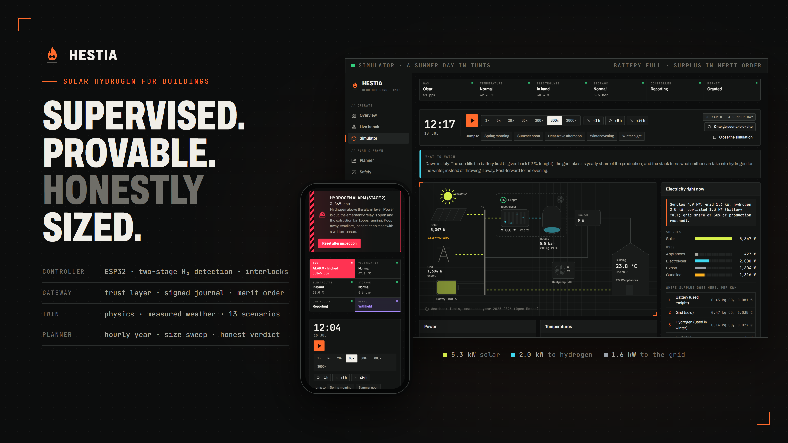 | **Cover.** The simulator on a summer day in Tunis; a stage-2 hydrogen alarm on a phone. |
| 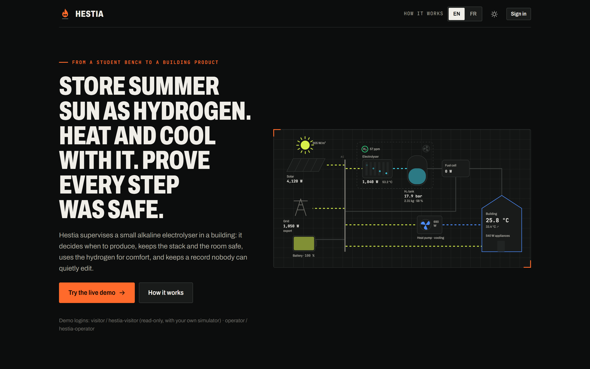 | **Home page.** Live process diagram, one-click demo. |
| 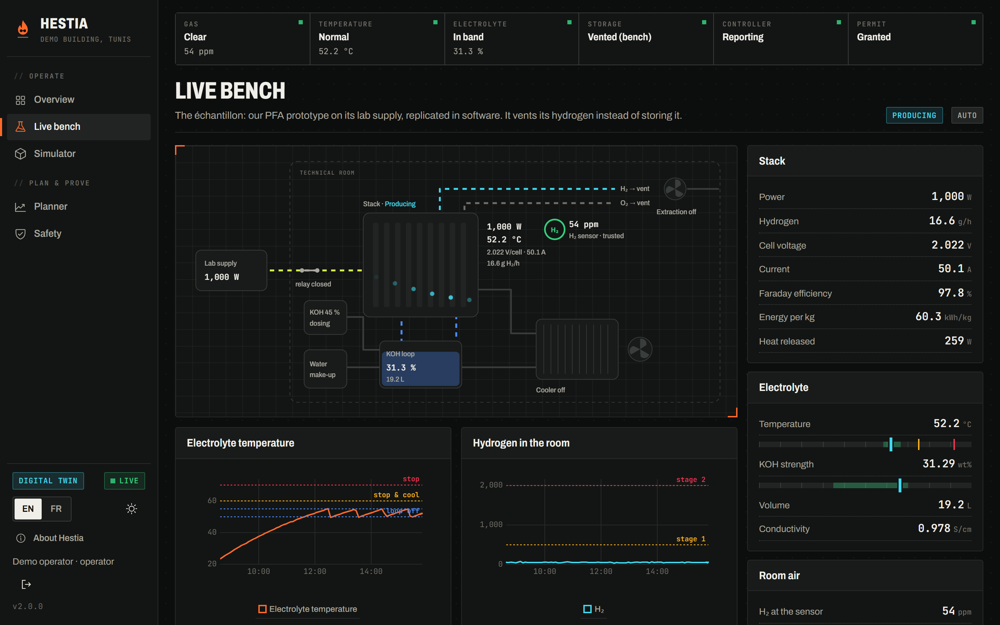 | **Live bench.** The PFA bench replicated: 1 kW stack producing, cooling loop holding 50-55 °C, every reading against its limits. |
| 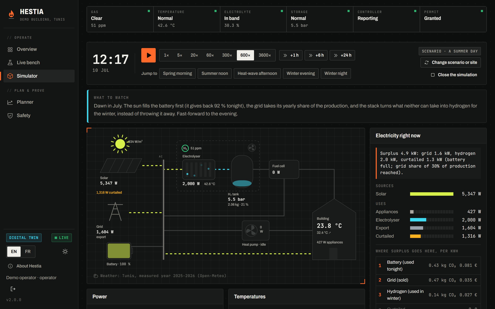 | **Summer noon.** Battery full, grid at its 30 % share, 2 kW to hydrogen. The dispatch line says why. |
| 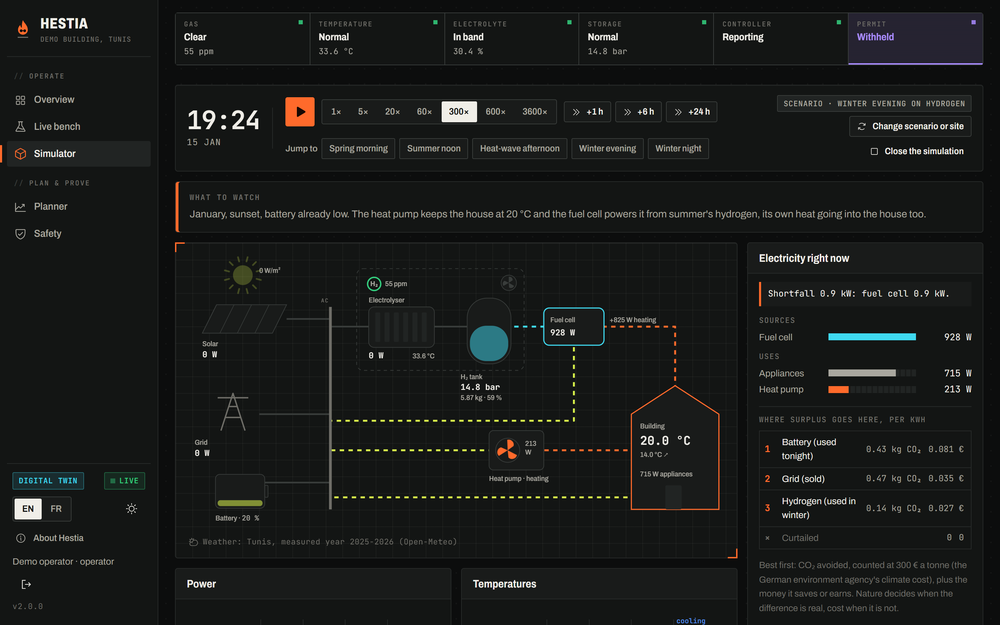 | **January evening.** The fuel cell runs the heat pump on summer's hydrogen; its heat goes into the house. |
| 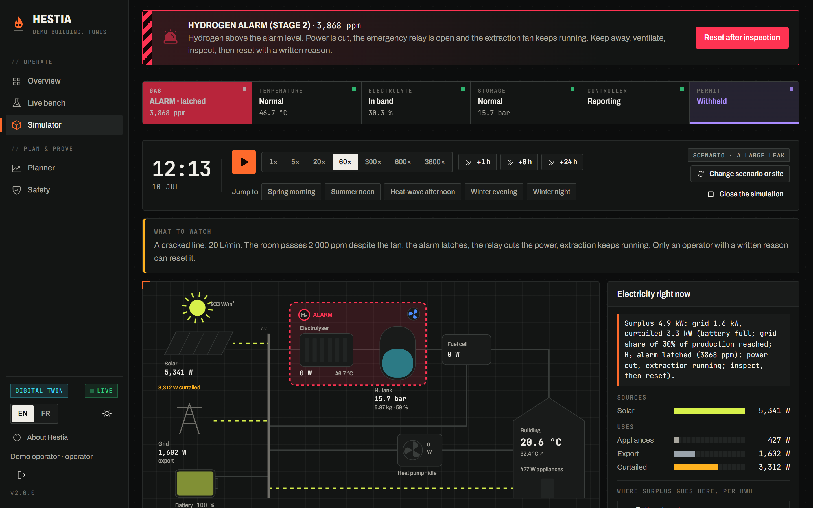 | **Large leak.** 2 000 ppm passed: power cut, alarm latched, extraction still running. |
| 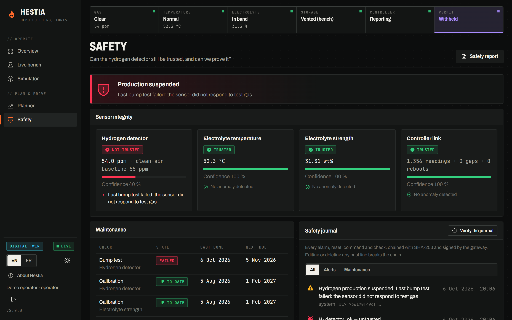 | **Poisoned sensor.** Reads clean air; the bump test fails, production stops, the journal records it. |
| 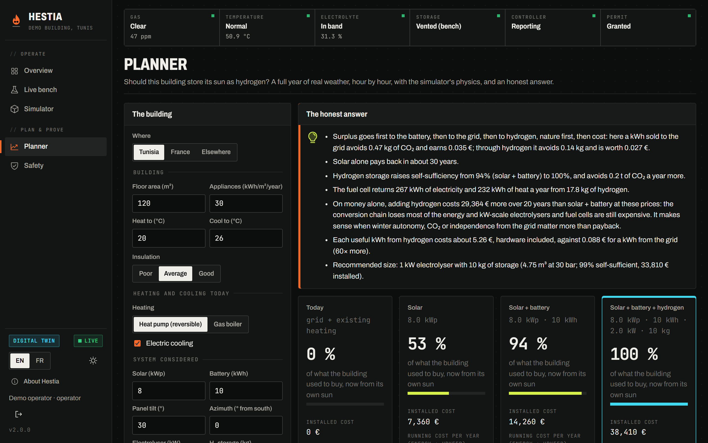 | **Planner.** A full year, four set-ups, and a verdict that says hydrogen doesn't pay on cost alone. |
| 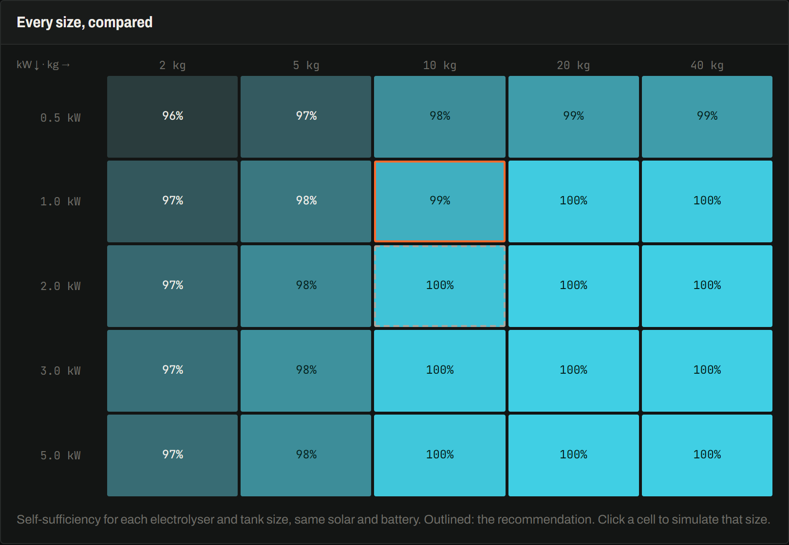 | **Size sweep.** Self-sufficiency for every electrolyser and tank size. |
| 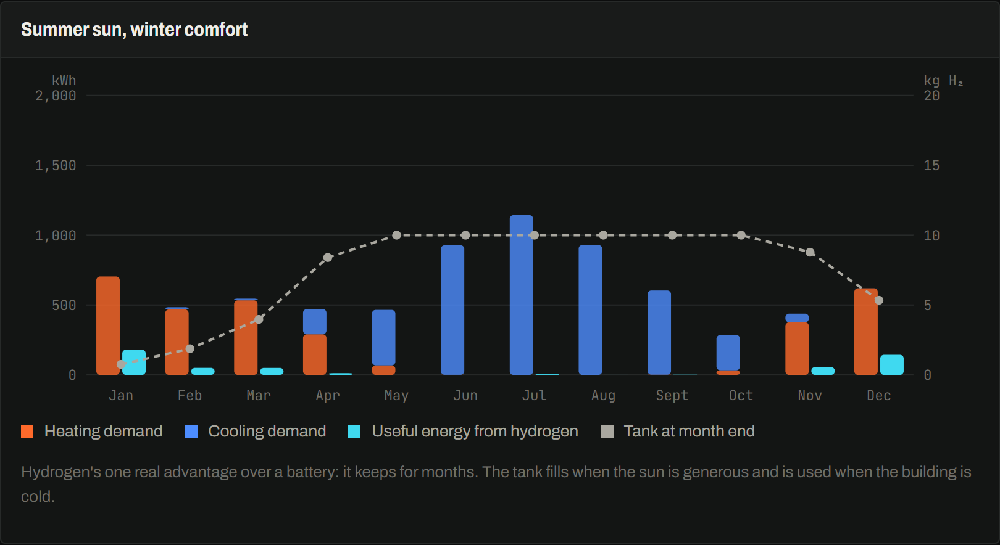 | **The year.** Heating, cooling, hydrogen used, tank level. |
| 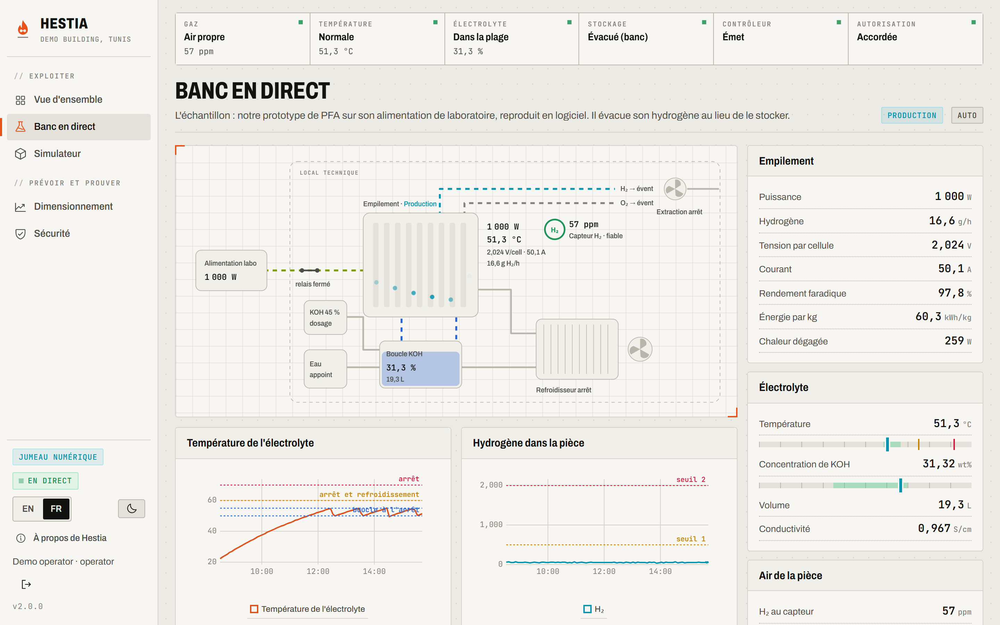 | **Light theme, French.** |
| 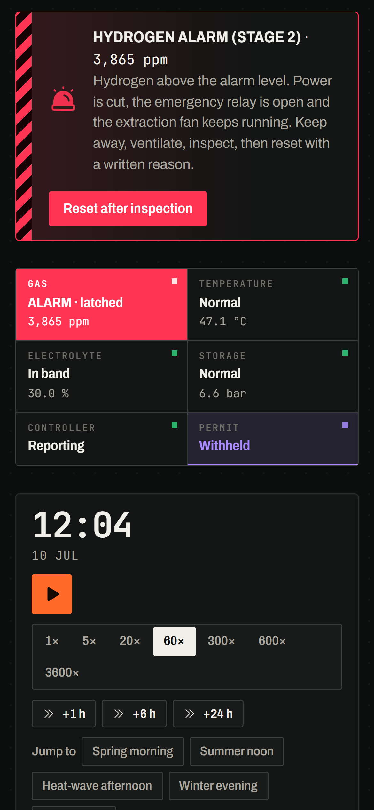 | **Phone.** The same alarm, on the go. |
